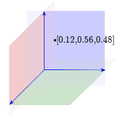
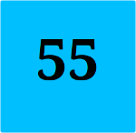
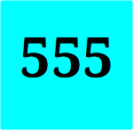
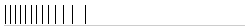
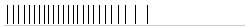
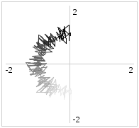
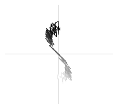

<strong>Simultaneous unsupervised and supervised learning   of cognitive functions in biologically plausible   spiking neural networks</strong>

<small>Trevor Bekolay, Carter Kolbeck, Chris Eliasmith  
*Centre for Theoretical Neuroscience, University of Waterloo*  
[bekolay.org/cogsci2013-pres](http://bekolay.org/cogsci2013-pres)</small>

<aside class="notes">
Hi, I'm Trevor.
I've always been interested in the issue of nature vs nurture.
I grew up being told that I could be anything I wanted to be.
But despite that, I never did manage to make it into the NHL,
and resigned myself to studying the brain instead.
When members of my lab came together to build
a large-scale model of the brain
I saw it as a golden opportunity to
answer a small part of the nature vs nurture question.
</aside>

<video preload="auto">
  <source src="img/spaun.mp4" type="video/mp4">
  Your browser does not support the video tag.
</video>

**How can we learn the connection weights   in the spiking neural networks in Spaun?**

<aside class="notes">
This is that full scale model. We call it Spaun.
Spaun is a network of 2.5 million simulated spiking neurons
that is able to do several high-level cognitive tasks.
In this video, Spaun is solving a problem that you might
find on an IQ test.
As it gets information about each cell,
it's trying to infer the transformation
between cells in each row.
Then, when we get to the last cell in the last row,
we ask Spaun what it thinks should go in that cell,
and it writes 333, which is the correct answer.
Spaun is able to accomplish this and other tasks
by representing information in populations of spiking neurons,
and transforming that information through connections
between populations of neurons.
In order to create Spaun, we analytically solve
for the connection weights between each neural population.
I wanted to know: Can the connection in Spaun be
the result of some learning process?
Could Spaun be the result of nurture?
Or would Spaun have to be hard-coded by nature?
</aside>

## 1. Cognitive functions

<strong>Vector Symbolic Architecture</strong> (Plate, 2003)

$\circ{5} \Rightarrow \left[ 0.12, 0.56, 0.48 \right] \Rightarrow$ 

<aside class="notes">
In order to answer this question,
we first have to understand how Spaun is able to
perform these cognitive tasks.
</aside>

 $= \text{COUNT} \circledast \circ{1}
+ \text{NUMBER} \circledast \circ{5}$

 $= \text{COUNT} \circledast \circ{2}
+ \text{NUMBER} \circledast \circ{5}$

$= \text{COUNT} \circledast \circ{3}
+ \text{NUMBER} \circledast \circ{5}$

<strong>How can we learn the binding function $\circledast$?</strong>

## 2. In spiking neurons

<strong>Neural Engineering Framework</strong> (Eliasmith & Anderson, 2003)

  
  
  
  
  
  
  
  
  
  

  

  

  

  

  

  

  

  

$X$,
$\;e_i$,
$\quad a_i = f(e_i \cdot X)$

  
  
  
  
  
  
  
  

  
  
$$\hat{X} = \sum_i \color{red}{d_i} a_i$$

  
  
  
  
  
  
  
  

  
  $$\hat{X} = \sum_i \color{red}{d_i} a_i$$

$$\omega_{ij} \propto e_i d_j$$

## 3. Learning

  

  Random initial $\omega_{ij}$

<!-- 
 -->
<!-- <ul> -->
<!--   <li>Supervised learning (MacNeil & Eliasmith, 2011)</li> -->
<!--   <li>Unsupervised learning</li> -->
<!-- </ul> -->
<!-- 
 -->

## Supervised learning

Given error $\color{red}{E} = X - \hat{X}$,

$$\Delta \omega\_{ij} \propto  a\_i \, e\_j \cdot E$$

## Unsupervised learning

$$\Delta \omega_{ij} \propto a_i \; \underbrace{a_j (a_j - E[a_j])}$$

----

<small>Bi & Poo (2001)</small>

----

<small>Kirkwood, Rioult & Bear (1996)</small>

## Combined learning

$$\Delta \omega\_{ij} \propto a\_i [\color{red}{S}
  \underbrace{e\_j \cdot E}\_{\color{blue}{\text{ Supervised}}}
  + \color{red}{(1 - S)} \,
  \underbrace{a\_j (a\_j - \theta)}\_{\color{blue}{\text{ Unsupervised}}}]$$

## Sparsity

0.18 0.51

Given an error signal, $E$, we can learn binding.

**How are error signals generated?**

Thanks to CNRGlab members, NSERC, CRC, CFI and OIT.

----

<small>Simultaneous unsupervised and supervised learning of cognitive functions  
in biologically plausible spiking neural networks</small>

[bekolay.org/cogsci2013-pres](http://bekolay.org/cogsci2013-pres)

[ tbekolay/cogsci2013](https://github.com/tbekolay/cogsci2013)

[ tbekolay/cogsci2013-pres](https://github.com/tbekolay/cogsci2013-pres)

## Learning transmission

## Learning parameters

Neurons per dimension, learning rate, supervision ratio ($S$)

[ jaberg/hyperopt](https://github.com/jaberg/hyperopt)

## Machine learning

